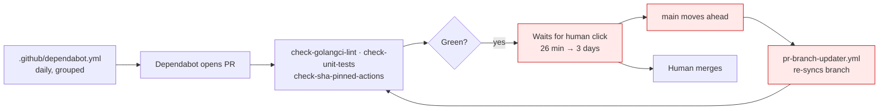
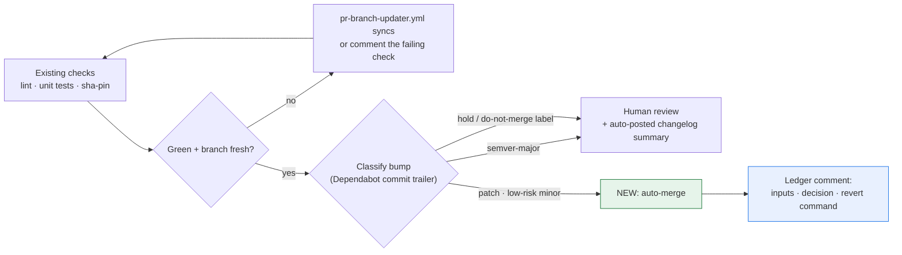
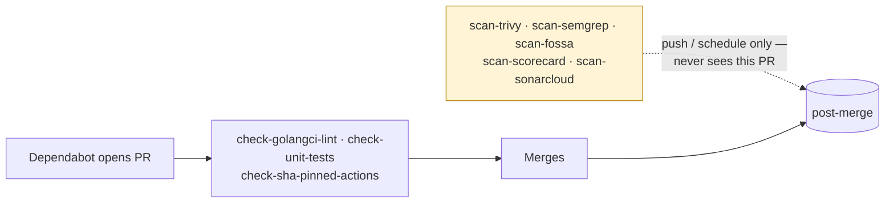
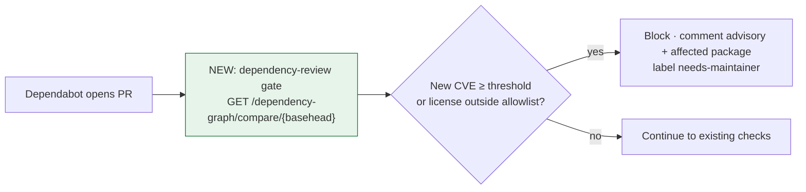
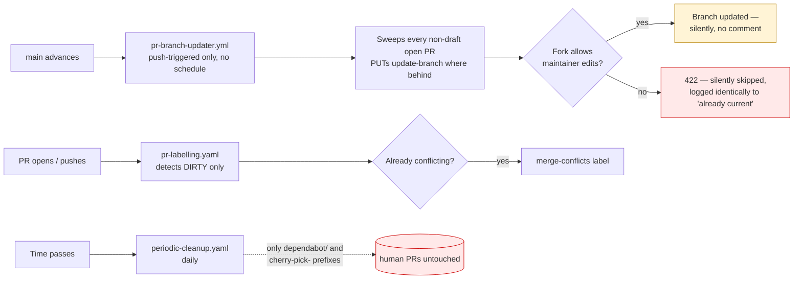
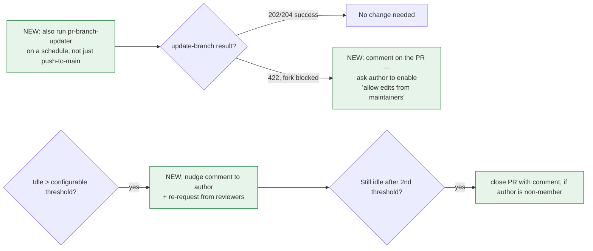

# Kyverno AI Maintainer Assistant — LFX Mentorship Proposal

> **Note:** This proposal is an integration of research already documented across multiple `.md` files in `prop/`.
> Raw evidence, full workflow reads, and live GitHub API results are intentionally kept in those files to avoid duplication here.
> Every number below is re-verifiable — I've linked the exact section header where it came from.
> **Reviewers are encouraged to open the linked sections** rather than trust the summary.

---

## 1. Dependency PR Handling

The issue description says maintainers spend recurring effort "reviewing/merging Dependabot PRs." Before designing anything I went and measured what that effort actually is, because the shape of the fix depends entirely on whether the problem is *volume* or something else. It turned out to be something else.

### 1.1 Volume is already solved — the real cost is waiting

`dependabot.yml` already groups `kubernetes`, `sigstore`, and `otel`, and at the time I checked there was exactly **1** open Dependabot PR (#17141) against **62 merged in the last 90 days** and 1,401 all-time. If I proposed "reduce bot PR noise," I'd be solving a problem the maintainers already fixed.
See: ["3. Real GitHub data (via MCP, live)"](https://github.com/kpj2006/test/blob/main/lfx-research-raw-deps.md#3-real-github-data-via-mcp-live-2026-08-16)

> *Screenshot to attach: `is:pr is:open author:app/dependabot` on kyverno/kyverno — one result.*

I sampled 12 recent merged Dependabot PRs commit-by-commit. In **every single one**, Dependabot's own commit was never amended, never force-pushed, never followed by a human fix-up — CI passed first try each time. The only extra commits were `Merge branch 'main' into dependabot/...`. So maintainers aren't fixing broken bumps. They're just… clicking merge, eventually. Time-to-merge ranged from ~26 minutes to ~3 days.
Have a look at [the same section — per-PR table with times and commit counts](https://github.com/kpj2006/test/blob/main/lfx-research-raw-deps.md#3-real-github-data-via-mcp-live-2026-08-16)

**Today:**

**Proposed — the exit from the queue:**

Auto-merge only what's genuinely low-judgment: never a human-authored bump, never a `semver-major` bump, and only `gomod`/`actions` patch bumps or low-risk `actions` minor bumps (`gomod` minor stays medium-risk, routed to a human). A `hold`/`do-not-merge`/`wip` label stops it outright, every required check has to be green on the latest commit (not a stale run from before a force-push), and the branch can't be behind `main` — `pr-branch-updater.yml` resolves that first.

Full predicate pseudocode: ["7. Auto-merge predicate"](https://github.com/kpj2006/test/blob/main/lfx-research-raw-deps.md#7-auto-merge-predicate-proposed-pseudocode)

Worth naming the existing alternative here: [Kodiak](https://kodiakhq.com) is a GitHub App that does roughly this already — auto-updates a PR branch when it's behind, then auto-merges once required checks and approvals are green, free for public repos. Adopting it would cover this without custom code. I'm still proposing the predicate above because it needs Kyverno-specific risk-tiering (bot-only, semver-aware, tied to the dependency-review gate below) that a generic merge bot doesn't know about — but this is a real build-vs-adopt call for maintainers to make, not something I should assume.

### 1.2 Nothing checks a dependency bump before it merges

This is the part I did not expect. I read all seven scan workflows in full. **Every one of them runs on `push` or `schedule` — none on `pull_request`.** Trivy, Semgrep, Scorecard, SonarCloud, FOSSA: all post-merge or nightly. Semgrep is additionally run with `--no-error`, so it structurally cannot fail its own job even if it were on a PR. The only workflow that genuinely gates a PR is `check-sha-pinned-actions.yaml`, and that checks SHA pinning of Actions — not whether a bumped package has a CVE.

There is no `dependency-review-action` anywhere in `.github/`. So today a bump introducing a vulnerable or badly-licensed package merges cleanly, and surfaces afterwards as an auto-filed issue from `sync-trivy-issues.yaml`.
See: ["1. Security/scan workflow table"](https://github.com/kpj2006/test/blob/main/lfx-research-raw-deps.md#1-securityscan-workflow-table-full-read-of-every-file) and ["4. PR-time security gaps"](https://github.com/kpj2006/test/blob/main/lfx-research-raw-deps.md#4-pr-time-security-gaps)

**Today:**

**Proposed — the gate:**

I've built this exact gate before, for AOSSIE's Template-Repo: [`dependency-review-action.yml`](https://github.com/AOSSIE-Org/Template-Repo/blob/main/.github/workflows/dependency-review-action.yml). Action reference: [actions/dependency-review-action](https://github.com/actions/dependency-review-action). The work here is adapting the severity/license rules to Kyverno's `DEPENDENCY-POLICY.md`.

### 1.3 A smaller gap, flagged rather than solved: two ecosystems invisible to Dependabot

There are **no Dockerfiles in the repo at all** — images are built with `ko`, and `.ko.yaml` pins its base image `ghcr.io/wolfi-dev/static:alpine` by **floating tag, not digest**. Dependabot's `docker` ecosystem parses Dockerfiles, so even adding it wouldn't see this. Separately, `charts/kyverno/Chart.yaml` pins 3 real external chart dependencies (`kyverno-api`, `openreports`, `reports-server`) that no automation touches.
Have a look at ["8. Docker / Helm dependency gaps"](https://github.com/kpj2006/test/blob/main/lfx-research-raw-deps.md#8-docker--helm-dependency-gaps)

### 1.4 A concrete first PR: `DEPENDENCY-POLICY.md` itself has drifted

I observed that `DEPENDENCY-POLICY.md` names four workflow files that don't exist under those names anymore — it says `trivy.yaml`, `trivy-periodic-scan.yaml`, `lint.yaml`, `scorecard.yaml`, but the real files are `scan-trivy.yaml`, `periodic-trivy.yaml`, `check-golangci-lint.yaml`, `scan-scorecard.yaml`. Nothing in CI catches this, so the policy doc has been silently wrong for a while. So a small PR should be made: update `DEPENDENCY-POLICY.md` to reference the actual filenames — a two-line diff, verifiable in minutes, and something I can land before the mentorship starts to show I've actually read the repo.
See: ["8.2 CODEOWNERS has already drifted"](https://github.com/kpj2006/test/blob/main/kyverno-lfx-research.md#82-codeowners-has-already-drifted--with-a-reproducible-example)

Open questions for you to review: ["9. Open questions for maintainers — Dependency PR Handling"](https://github.com/kpj2006/test/blob/main/lfx-research-raw-deps.md#9-open-questions-for-maintainers-dependency-pr-handling)

---

## 2. PR Hygiene

The mentor issue asks for four things: detect PRs behind `main`, auto-update the branch when mergeable, re-trigger CI, and nudge stale PRs/reviewers after an idle period. I pulled live numbers before assuming any of that was missing.

### 2.1 The backlog drifts silently, and nothing brings it back

Right now `kyverno/kyverno` has **304 open PRs**. Of those, **292 (96%) have never received a single review**, and **74 (24%) are already sitting with the `merge-conflicts` label**. Idle time is worse than I expected: **213 (70%) haven't been updated in over a week**, **167 (55%) not in two weeks**, and 6 haven't moved in **60+ days** — two of them, [#14621](https://github.com/kyverno/kyverno/pull/14621) and [#15037](https://github.com/kyverno/kyverno/pull/15037), since **January**, over 4 months idle with zero activity.

I also cross-checked whether this is inflated by auto-opened PRs. The only non-human PR authors in the open backlog are Dependabot (tracked separately in §1) and a single cherry-pick-automation PR, [#15978](https://github.com/kyverno/kyverno/pull/15978) (`kyverno-bot`, opened by `cherry-pick-on-merge.yaml`). Excluding `kyverno-bot` alone still leaves 303 of 304. This is real human-authored backlog, not a bot-count artifact.
See live: [open PRs](https://github.com/kyverno/kyverno/pulls?q=is%3Apr+is%3Aopen) · [no reviews](https://github.com/kyverno/kyverno/pulls?q=is%3Apr+is%3Aopen+review%3Anone) · [merge-conflicts](https://github.com/kyverno/kyverno/pulls?q=is%3Apr+is%3Aopen+label%3Amerge-conflicts) · [idle 14+ days](https://github.com/kyverno/kyverno/pulls?q=is%3Apr+is%3Aopen+updated%3A%3C2026-08-04) · [excluding kyverno-bot](https://github.com/kyverno/kyverno/pulls?q=is%3Apr+is%3Aopen+-author%3Akyverno-bot)

Three separate mechanisms are involved, and I read the actual source of all three — including the reusable workflow's shell script, which lives outside this repo and turned out to matter a lot:

- `pr-labelling.yaml` runs `eps1lon/actions-label-merge-conflict`, which labels a PR only once it's actually **dirty** — i.e. GitHub can no longer auto-merge it. A PR that's cleanly behind `main` with no conflict never gets this label. See: [`pr-labelling.yaml`](https://github.com/kyverno/kyverno/blob/main/.github/workflows/pr-labelling.yaml)
- `pr-branch-updater.yml` already solves the "quietly drifting" case — see [`update-pr-branches.sh`](https://github.com/kyverno/.github/blob/main/.github/workflows/pr-branch-updater.yml). Two limits remain: it only runs on a push to `main` — no schedule — and it never comments; success and failure both happen silently.
- That silence hides a real gap: in the script's `case "$STATUS_CODE"` handling, a `422` (fork PR without "Allow edits from maintainers" enabled) is logged under the exact same `SKIPPED` counter as `409` ("already up to date") — no distinction between the two. Given how many of the 304 open PRs are external contributions, a real fraction of "still behind" PRs are ones this tooling already tried and silently gave up on. Likely why: "Allow edits from maintainers" is a per-PR author checkbox, not an admin-side setting — see [GitHub Docs](https://docs.github.com/en/pull-requests/collaborating-with-pull-requests/working-with-forks/allowing-changes-to-a-pull-request-branch-created-from-a-fork).
- `periodic-cleanup.yaml` deletes stale branches daily, but only ones matching `allowed-prefixes: dependabot/, temp-cherry-pick-, cherry-pick-`. A contributor's own branch is never touched by this, in either direction. See: [`periodic-cleanup.yaml`](https://github.com/kyverno/kyverno/blob/main/.github/workflows/periodic-cleanup.yaml)

**Today:**

**Proposed:**

Have a look at [`actions/stale`](https://github.com/actions/stale) — we should add this, similar to what I've already added in AOSSIE's Template-Repo: [`stale.yml`](https://github.com/AOSSIE-Org/Template-Repo/blob/main/.github/workflows/stale.yml). See its different inputs supported (per-label overrides, exempt labels/assignees, separate PR vs. issue thresholds, etc.) for tuning to Kyverno's own policy. It doesn't touch the fork-blocked/schedule gap above — that part is a small, targeted addition to the existing `pr-branch-updater.yml`, not a new system.

Same thundering-herd concern as the dependency section applies here at a larger scale: 304 open PRs means a single push to `main` could trigger 304 simultaneous rebase attempts. `pr-branch-updater.yml` already runs its own updates under `concurrency: pr-branch-updater` with `cancel-in-progress: false` — any new staleness check needs to queue behind that same discipline, not add a second uncoordinated burst(we also need to think about the implications of this approach necessarily).

### 2.2 Re-triggering CI already has a two-line fix available

`comment-prow.yaml` has `jpmcb/prow-github-actions` installed and wired up, but the enabled command list is only `/assign /unassign /lgtm /milestone`. `/retest` is supported by that same action and simply isn't turned on — enabling it is a two-line config change, not something that needs a phase of its own.
See: [`comment-prow.yaml`](https://github.com/kyverno/kyverno/blob/main/.github/workflows/comment-prow.yaml)

Open questions for you to review: ["1. Open questions for maintainers — PR Hygiene"](https://github.com/kpj2006/test/blob/main/lfx-research-raw-pr-hygiene.md#1-open-questions-for-maintainers-pr-hygiene)
