# Kyverno AI Maintainer Assistant — LFX Mentorship Proposal

> **Note:** This proposal is an integration of research already documented across multiple `.md` files in `prop/`.
> Raw evidence, full workflow reads, and live GitHub API results are intentionally kept in those files to avoid duplication here.
> Every number below is re-verifiable — I've linked the exact section header where it came from.
> **Reviewers are encouraged to open the linked sections** rather than trust the summary.

---

## 1. Dependency PR Handling

The issue description says maintainers spend recurring effort "reviewing/merging Dependabot PRs." Before designing anything I went and measured what that effort actually is, because the shape of the fix depends entirely on whether the problem is *volume* or something else. It turned out to be something else.

### 1.1 Volume is already solved — the real cost is waiting

`dependabot.yml` already groups `kubernetes`, `sigstore`, and `otel`, and at the time I checked there was exactly **1** open Dependabot PR (#17141) against **62 merged in the last 90 days** and 1,401 all-time. If I proposed "reduce bot PR noise," I'd be solving a problem the maintainers already fixed.
See: ["3. Real GitHub data (via MCP, live)"](https://github.com/kpj2006/test/blob/main/lfx-research-raw-deps.md#3-real-github-data-via-mcp-live-2026-08-16)


> *Screenshot to attach: `is:pr is:open author:app/dependabot` on kyverno/kyverno — one result.*

I sampled 12 recent merged Dependabot PRs commit-by-commit. In **every single one**, Dependabot's own commit was never amended, never force-pushed, never followed by a human fix-up — CI passed first try each time. The only extra commits were `Merge branch 'main' into dependabot/...`. So maintainers aren't fixing broken bumps. They're just… clicking merge, eventually. Time-to-merge ranged from ~26 minutes to ~3 days.
Have a look at [the same section — per-PR table with times and commit counts](https://github.com/kpj2006/test/blob/main/lfx-research-raw-deps.md#3-real-github-data-via-mcp-live-2026-08-16)

**Today:**

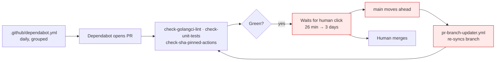

**Proposed — the exit from the queue:**

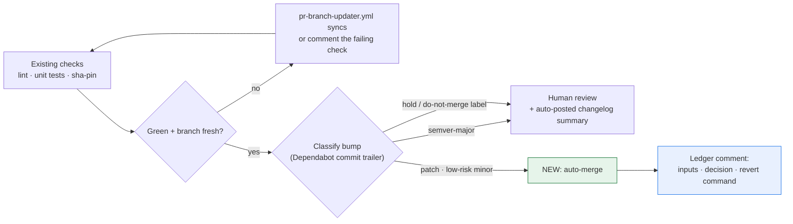

Auto-merge only what's genuinely low-judgment: never a human-authored bump, never a `semver-major` bump, and only `gomod`/`actions` patch bumps or low-risk `actions` minor bumps (`gomod` minor stays medium-risk, routed to a human). A `hold`/`do-not-merge`/`wip` label stops it outright, every required check has to be green on the latest commit (not a stale run from before a force-push), and the branch can't be behind `main` — `pr-branch-updater.yml` resolves that first.

Full predicate pseudocode: ["7. Auto-merge predicate"](https://github.com/kpj2006/test/blob/main/lfx-research-raw-deps.md#7-auto-merge-predicate-proposed-pseudocode)

Worth naming the existing alternative here: [Kodiak](https://kodiakhq.com) is a GitHub App that does roughly this already — auto-updates a PR branch when it's behind, then auto-merges once required checks and approvals are green, free for public repos. Adopting it would cover this without custom code. I'm still proposing the predicate above because it needs Kyverno-specific risk-tiering (bot-only, semver-aware, tied to the dependency-review gate below) that a generic merge bot doesn't know about — but this is a real build-vs-adopt call for maintainers to make, not something I should assume.

### 1.2 Nothing checks a dependency bump before it merges

This is the part I did not expect. I read all seven scan workflows in full. **Every one of them runs on `push` or `schedule` — none on `pull_request`.** Trivy, Semgrep, Scorecard, SonarCloud, FOSSA: all post-merge or nightly. Semgrep is additionally run with `--no-error`, so it structurally cannot fail its own job even if it were on a PR. The only workflow that genuinely gates a PR is `check-sha-pinned-actions.yaml`, and that checks SHA pinning of Actions — not whether a bumped package has a CVE.

There is no `dependency-review-action` anywhere in `.github/`. So today a bump introducing a vulnerable or badly-licensed package merges cleanly, and surfaces afterwards as an auto-filed issue from `sync-trivy-issues.yaml`.
See: ["1. Security/scan workflow table"](https://github.com/kpj2006/test/blob/main/lfx-research-raw-deps.md#1-securityscan-workflow-table-full-read-of-every-file) and ["4. PR-time security gaps"](https://github.com/kpj2006/test/blob/main/lfx-research-raw-deps.md#4-pr-time-security-gaps)

**Today:**

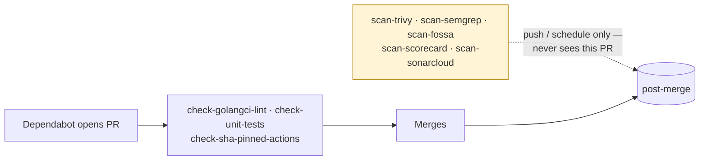

**Proposed — the gate:**

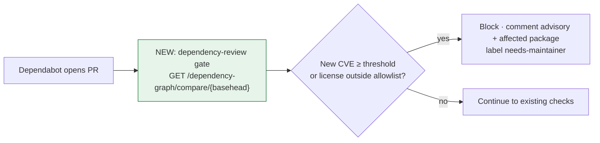

I've built this exact gate before, for AOSSIE's Template-Repo: [`dependency-review-action.yml`](https://github.com/AOSSIE-Org/Template-Repo/blob/main/.github/workflows/dependency-review-action.yml). Action reference: [actions/dependency-review-action](https://github.com/actions/dependency-review-action). The work here is adapting the severity/license rules to Kyverno's `DEPENDENCY-POLICY.md`.

### 1.3 A smaller gap, flagged rather than solved: two ecosystems invisible to Dependabot

There are **no Dockerfiles in the repo at all** — images are built with `ko`, and `.ko.yaml` pins its base image `ghcr.io/wolfi-dev/static:alpine` by **floating tag, not digest**. Dependabot's `docker` ecosystem parses Dockerfiles, so even adding it wouldn't see this. Separately, `charts/kyverno/Chart.yaml` pins 3 real external chart dependencies (`kyverno-api`, `openreports`, `reports-server`) that no automation touches.
Have a look at ["8. Docker / Helm dependency gaps"](https://github.com/kpj2006/test/blob/main/lfx-research-raw-deps.md#8-docker--helm-dependency-gaps)

### 1.4 A concrete first PR: `DEPENDENCY-POLICY.md` itself has drifted

I observed that `DEPENDENCY-POLICY.md` names four workflow files that don't exist under those names anymore — it says `trivy.yaml`, `trivy-periodic-scan.yaml`, `lint.yaml`, `scorecard.yaml`, but the real files are `scan-trivy.yaml`, `periodic-trivy.yaml`, `check-golangci-lint.yaml`, `scan-scorecard.yaml`. Nothing in CI catches this, so the policy doc has been silently wrong for a while. So a small PR should be made: update `DEPENDENCY-POLICY.md` to reference the actual filenames — a two-line diff, verifiable in minutes, and something I can land before the mentorship starts to show I've actually read the repo.
See: ["8.2 CODEOWNERS has already drifted"](https://github.com/kpj2006/test/blob/main/kyverno-lfx-research.md#82-codeowners-has-already-drifted--with-a-reproducible-example)

Open questions for you to review: ["9. Open questions for maintainers — Dependency PR Handling"](https://github.com/kpj2006/test/blob/main/lfx-research-raw-deps.md#9-open-questions-for-maintainers-dependency-pr-handling)

---

## 2. PR Hygiene

The mentor issue asks for four things: detect PRs behind `main`, auto-update the branch when mergeable, re-trigger CI, and nudge stale PRs/reviewers after an idle period. I pulled live numbers before assuming any of that was missing.

### 2.1 The backlog drifts silently, and nothing brings it back

Right now `kyverno/kyverno` has **304 open PRs**. Of those, **292 (96%) have never received a single review**, and **74 (24%) are already sitting with the `merge-conflicts` label**. Idle time is worse than I expected: **213 (70%) haven't been updated in over a week**, **167 (55%) not in two weeks**, and 6 haven't moved in **60+ days** — two of them, [#14621](https://github.com/kyverno/kyverno/pull/14621) and [#15037](https://github.com/kyverno/kyverno/pull/15037), since **January**, over 4 months idle with zero activity.

I also cross-checked whether this is inflated by auto-opened PRs. The only non-human PR authors in the open backlog are Dependabot (tracked separately in §1) and a single cherry-pick-automation PR, [#15978](https://github.com/kyverno/kyverno/pull/15978) (`kyverno-bot`, opened by `cherry-pick-on-merge.yaml`). Excluding `kyverno-bot` alone still leaves 303 of 304. This is real human-authored backlog, not a bot-count artifact.
See live: [open PRs](https://github.com/kyverno/kyverno/pulls?q=is%3Apr+is%3Aopen) · [no reviews](https://github.com/kyverno/kyverno/pulls?q=is%3Apr+is%3Aopen+review%3Anone) · [merge-conflicts](https://github.com/kyverno/kyverno/pulls?q=is%3Apr+is%3Aopen+label%3Amerge-conflicts) · [idle 14+ days](https://github.com/kyverno/kyverno/pulls?q=is%3Apr+is%3Aopen+updated%3A%3C2026-08-04) · [excluding kyverno-bot](https://github.com/kyverno/kyverno/pulls?q=is%3Apr+is%3Aopen+-author%3Akyverno-bot)

Three separate mechanisms are involved, and I read the actual source of all three — including the reusable workflow's shell script, which lives outside this repo and turned out to matter a lot:

- `pr-labelling.yaml` runs `eps1lon/actions-label-merge-conflict`, which labels a PR only once it's actually **dirty** — i.e. GitHub can no longer auto-merge it. A PR that's cleanly behind `main` with no conflict never gets this label. See: [`pr-labelling.yaml`](https://github.com/kyverno/kyverno/blob/main/.github/workflows/pr-labelling.yaml)
- `pr-branch-updater.yml` already solves the "quietly drifting" case — see [`update-pr-branches.sh`](https://github.com/kyverno/.github/blob/main/.github/workflows/pr-branch-updater.yml). Two limits remain: it only runs on a push to `main` — no schedule — and it never comments; success and failure both happen silently.
- That silence hides a real gap: in the script's `case "$STATUS_CODE"` handling, a `422` (fork PR without "Allow edits from maintainers" enabled) is logged under the exact same `SKIPPED` counter as `409` ("already up to date") — no distinction between the two. Given how many of the 304 open PRs are external contributions, a real fraction of "still behind" PRs are ones this tooling already tried and silently gave up on. Likely why: "Allow edits from maintainers" is a per-PR author checkbox, not an admin-side setting — see [GitHub Docs](https://docs.github.com/en/pull-requests/collaborating-with-pull-requests/working-with-forks/allowing-changes-to-a-pull-request-branch-created-from-a-fork).
- `periodic-cleanup.yaml` deletes stale branches daily, but only ones matching `allowed-prefixes: dependabot/, temp-cherry-pick-, cherry-pick-`. A contributor's own branch is never touched by this, in either direction. See: [`periodic-cleanup.yaml`](https://github.com/kyverno/kyverno/blob/main/.github/workflows/periodic-cleanup.yaml)

**Today:**

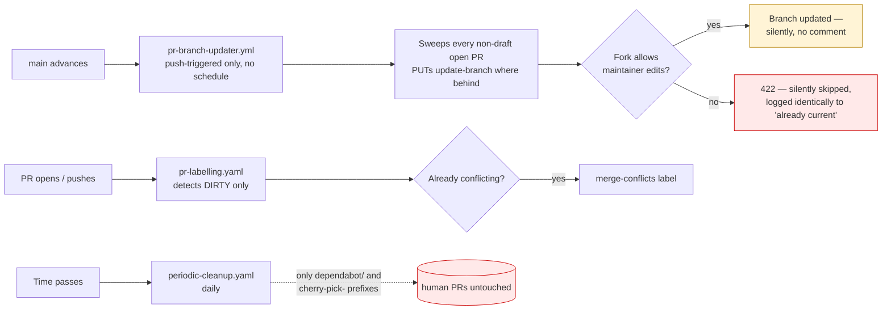

**Proposed:**

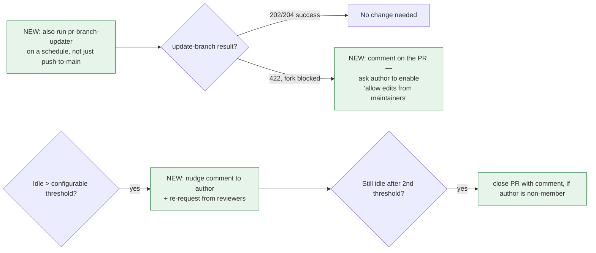

Have a look at [`actions/stale`](https://github.com/actions/stale) — we should add this, similar to what I've already added in AOSSIE's Template-Repo: [`stale.yml`](https://github.com/AOSSIE-Org/Template-Repo/blob/main/.github/workflows/stale.yml). See its different inputs supported (per-label overrides, exempt labels/assignees, separate PR vs. issue thresholds, etc.) for tuning to Kyverno's own policy. It doesn't touch the fork-blocked/schedule gap above — that part is a small, targeted addition to the existing `pr-branch-updater.yml`, not a new system.

Same thundering-herd concern as the dependency section applies here at a larger scale: 304 open PRs means a single push to `main` could trigger 304 simultaneous rebase attempts. `pr-branch-updater.yml` already runs its own updates under `concurrency: pr-branch-updater` with `cancel-in-progress: false` — any new staleness check needs to queue behind that same discipline, not add a second uncoordinated burst(we also need to think about the implications of this approach necessarily).


### 2.2 Re-triggering CI already has a two-line fix available

`comment-prow.yaml` has `jpmcb/prow-github-actions` installed and wired up, but the enabled command list is only `/assign /unassign /lgtm /milestone`. `/retest` is supported by that same action and simply isn't turned on — enabling it is a two-line config change, not something that needs a phase of its own.
See: [`comment-prow.yaml`](https://github.com/kyverno/kyverno/blob/main/.github/workflows/comment-prow.yaml)

Open questions for you to review: ["1. Open questions for maintainers — PR Hygiene"](https://github.com/kpj2006/test/blob/main/lfx-research-raw-pr-hygiene.md#1-open-questions-for-maintainers-pr-hygiene)

---

## 3. AI-Assisted PR Review & Enrichment (CodeRabbit)

I discussed this with the maintainers directly on Slack, and they suggested to add CodeRabbit(my finding) to the proposal. So the question this section answers isn't whether to adopt it — it's which of its capabilities to turn on and how to configure them for Kyverno specifically. It ships its Pro-tier feature set free, with no time limit, on public repositories, so the real constraint below is the review rate cap, not cost — covered in §3.9.
See: [CodeRabbit code review overview](https://docs.coderabbit.ai/guides/code-review-overview)

### 3.1 PR summary

We should remove the manual PR summary entirely — CodeRabbit generates one from the actual changes on every push. See: [PR summaries](https://docs.coderabbit.ai/pr-reviews/summaries)

### 3.2 Walkthrough comment

Covers file-by-file summary, related/duplicate issue and PR detection, and a review-effort estimate — no need to hand-maintain "Related issue." See: [Walkthroughs](https://docs.coderabbit.ai/pr-reviews/walkthroughs)

### 3.3 Custom reviewer rules

We can auto-suggest or auto-assign reviewers by condition instead of relying on CODEOWNERS alone. See: [Custom reviewer rules](https://docs.coderabbit.ai/pr-reviews/walkthroughs#custom-reviewer-rules)

### 3.4 Change Stack

Large PRs can be reviewed layer-by-layer instead of file-by-file — a feature I suggested to the CodeRabbit team directly. See: [Change Stack](https://docs.coderabbit.ai/pr-reviews/change-stack)

### 3.5 Slop detection

We can flag likely low-effort AI-generated PRs automatically, alongside the existing AI-disclosure checkbox in the PR template. See: [Slop detection](https://docs.coderabbit.ai/pr-reviews/slop-detection)

### 3.6 Path-based and AST-grep instructions

We can give CodeRabbit per-path review instructions, and later AST-grep rules for structural patterns. See: [Path instructions](https://docs.coderabbit.ai/configuration/path-instructions) and [AST-grep instructions](https://docs.coderabbit.ai/configuration/ast-grep-instructions)

### 3.7 Review commands and issue creation

CodeRabbit has its own comment commands, and can open issues directly from review findings. See: [Commands](https://docs.coderabbit.ai/guides/commands) and [Issue creation](https://docs.coderabbit.ai/issues/creation)

### 3.8 Pre-merge checks

We can add pre-merge checks for PR title, description, docstring coverage, and issue-claim accuracy, starting in warning mode. See: [Pre-merge checks](https://docs.coderabbit.ai/pr-reviews/pre-merge-checks)

### 3.9 Post-merge actions

We can auto-append changelog entries after merge instead of doing it by hand. See: [Post-merge actions](https://docs.coderabbit.ai/pr-reviews/post-merge-actions)

### 3.10 Multi-repo analysis

Kyverno's ecosystem spans multiple repos (policies, reports-server, SDKs) — CodeRabbit can link them and flag cross-repo breaking changes, though automatic linking needs Pro+. See: [Multi-repo analysis](https://docs.coderabbit.ai/knowledge-base/multi-repo-analysis)

### 3.11 Issue enrichment

CodeRabbit can auto-enrich issues with related code, potential solutions, and a complexity assessment. See: [Issue enrichment](https://docs.coderabbit.ai/issues/enrichment)

### 3.12 Ready-made configs

There are existing `.coderabbit.yaml` examples we can start from instead of writing one from scratch. See: [awesome-coderabbit configs](https://github.com/coderabbitai/awesome-coderabbit/tree/main/configs)

### 3.13 Configuration inheritance

Settings can be layered instead of duplicated per repo — worth using given Kyverno's multiple repos. See: [Configuration inheritance](https://docs.coderabbit.ai/configuration/configuration-inheritance)

### 3.14 Review rate cap

The real constraint is CodeRabbit's OSS review rate cap (1–10/hour by star count), not cost. See: [Plans and rate limits](https://docs.coderabbit.ai/management/plans)

### 3.15 Issue triage

Kyverno's issue templates (`bug-cli.yaml`, `bug-webhook.yaml`, `bug-other.yaml`, `feature.yaml`) already pre-classify, so classification itself isn't the gap. Missing-info detection and enrichment — related code, potential solutions, complexity — can run through CodeRabbit instead of a custom triage agent. See: [Issue enrichment](https://docs.coderabbit.ai/issues/enrichment)

Automated reproduction — spinning up a KinD cluster, applying the reported policy/resource, capturing actual vs. expected — is outside CodeRabbit's scope. The repro artifact should be a chainsaw test, not a log, built on the existing `make kind-create-cluster` / `.github/actions/tests/conformance/run` harness — that stays a separate, custom build.

### 3.16 Slack/Discussions Q&A

CodeRabbit has its own Slack agent — it answers grounded in the connected repo/docs and can open PRs directly from Slack. It doesn't document an explicit low-confidence escalation path, so a citation-mandatory, escalate-when-retrieval-is-weak rule on top of it still matters, not instead of it. See: [Slack agent](https://docs.coderabbit.ai/slack-agent)

### 3.17 Flagging when docs need updating

CodeRabbit's path instructions can flag that a `kyverno/website` doc PR is expected whenever specific paths change (CLI flags, CRD fields, Helm values) — the same nudge the PR template already asks for but nothing currently verifies. See: [Path instructions](https://docs.coderabbit.ai/configuration/path-instructions)

There are more tools beyond what's covered above — I didn't have time to explore all of them for this proposal. See: [Tools list](https://docs.coderabbit.ai/tools/list)

Open questions for you to review: ["1. Open questions for maintainers — CodeRabbit"](https://github.com/kpj2006/test/blob/main/lfx-research-raw-coderabbit.md#1-open-questions-for-maintainers-coderabbit)

---

## 4. Scoped Test Selection

### 4.1 Conformance is post-merge because pre-merge is too expensive

`check-tests.yaml` triggers on `push` to `main`/`release-*` only — no `pull_request` trigger. On a PR, conformance is opt-in via a `/conformance` comment (`comment-conformance.yaml`). Why: `tests-conformance.yaml` has 55 top-level jobs, several sharded up to 12 ways (`generate`, `generating-policies`, `deleting-policies`), and `rbac` alone is matrixed 9 ways (3 configs × 3 k8s versions) — a full firing expands to several hundred runner-jobs. Across the 304 open PRs from §2.1, running that per PR isn't viable, so regressions land on `main` and surface only via the post-merge run: `.github/actions/workflow/failure-issue` auto-files an issue on failure, and there are 95 open issues carrying the `workflow-failure` label today.
See: [`check-tests.yaml`](https://github.com/kyverno/kyverno/blob/main/.github/workflows/check-tests.yaml), [`tests-conformance.yaml`](https://github.com/kyverno/kyverno/blob/main/.github/workflows/tests-conformance.yaml), [`comment-conformance.yaml`](https://github.com/kyverno/kyverno/blob/main/.github/workflows/comment-conformance.yaml)

**Today:**
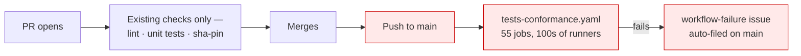

**Proposed:**
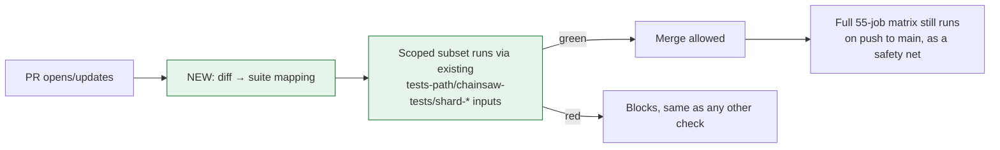

The runner itself doesn't need building: `.github/actions/tests/conformance/run/action.yaml` already accepts `tests-path`, a `chainsaw-tests` regex, `shard-index`/`shard-count`, and `quarantined-tests` as inputs. What's missing is the "which suites does this diff need" logic that decides what to pass into those inputs.
See: [`action.yaml`](https://github.com/kyverno/kyverno/blob/main/.github/actions/tests/conformance/run/action.yaml)

### 4.2 The mapping layer: extend `.github/labels.yml`, don't add a parallel file

`.github/labels.yml` (526 lines) already holds `rules: changed-files` globs per area, rendered by `pr-labelling.yaml` through `yq`/`jq` into an `actions/labeler` config at runtime. The clean move is a sibling key on the same entries, reusing that one source of truth instead of maintaining a second path map:

```yaml
area/engine:
  rules:
    - changed-files:
        - any-glob-to-any-file: [pkg/engine/**]
  suites: [assert, autogen, mutate, validate]   # NEW
  unit: ["./pkg/engine/..."]                     # NEW
```

See: [`labels.yml`](https://github.com/kyverno/kyverno/blob/main/.github/labels.yml)

### 4.3 One blind spot a path diff alone misses: the CEL policy CRDs live in a different repo

`ValidatingPolicy`, `MutatingPolicy`, `GeneratingPolicy`, `DeletingPolicy`, and `ImageValidatingPolicy` aren't defined in this repo — they live in the external module `github.com/kyverno/api`, bumped roughly monthly. A selector that only reads `git diff --name-only` sees a `go.mod` change and nothing else, and would under-select — missing the entire CEL-policy conformance surface a version bump could actually affect. This needs an explicit rule, not an edge case discovered later: a `go.mod` diff touching any `github.com/kyverno/*` dependency maps to a hardcoded broad suite set, separate from the normal path lookup.

### 4.4 Unit-test selection: a verified pipeline via Go's build graph

Because the repo is a single Go module, a `go list -deps` reverse-dependency walk selects affected unit tests without per-module stitching. Run live against the repo: `pkg/engine` → 45 transitive dependents (41 with real `go test` targets); `pkg/cel/policies/vpol` → exactly 1 dependent (`pkg/webhooks/policy`); `pkg/webhooks/handlers` → 12 dependents; `pkg/image/verification` → 0, a leaf package. The same §4.3 caveat applies here too — an external-module bump needs the same override, not just the path-based lookup.
Full pipeline and numbers: ["2. Unit-test selection via Go's build graph"](https://github.com/kpj2006/test/blob/main/lfx-research-raw-test-selection.md#2-unit-test-selection-via-gos-build-graph--full-verified-pipeline)

### 4.5 Scoped selection needs to reach two suites it doesn't today

Even the existing `/conformance` PR opt-in never reaches `tests-k6.yaml` (perf regression) or `tests-conformance-policy-library.yaml` (the external `kyverno/policies` repo's own chainsaw suite) — both are `workflow_call`-only, reachable exclusively from the push-triggered orchestrator. So today, even a maintainer who explicitly asks for conformance on a PR gets zero perf-regression and zero policy-library-compatibility signal pre-merge. Scoped selection needs to close this gap too, not just make the existing opt-in cheaper.
See: [`tests-k6.yaml`](https://github.com/kyverno/kyverno/blob/main/.github/workflows/tests-k6.yaml) and [`tests-conformance-policy-library.yaml`](https://github.com/kyverno/kyverno/blob/main/.github/workflows/tests-conformance-policy-library.yaml)

### 4.6 A concrete first PR: two conformance suites have been dead since a schema-lint chore

`test/conformance/chainsaw/configs/` and `test/conformance/chainsaw/flags/standard/emit-events/` have zero `tests-path:` references anywhere in `.github/`, and are the only 2 of 52 suite roots with no `.chainsaw.yaml` file — they haven't actually run since at least the schema-lint commit that last touched them. A small CI check diffing the suite directories under `test/conformance/chainsaw` against every `tests-path:` value across the workflow YAML would catch this deterministically, no LLM required — a landable pre-mentorship PR alongside the other small fixes already flagged in §1.4.

Open questions for you to review: ["1. Open questions for maintainers — Scoped Test Selection"](https://github.com/kpj2006/test/blob/main/lfx-research-raw-test-selection.md#1-open-questions-for-maintainers-scoped-test-selection)

---

## 5. Codegen & Verify Gate

`check-codegen.yaml` already runs `make codegen-all-code` → `make verify-codegen` (and the same pair for docs) on every PR and push. On a mismatch it doesn't fail silently — it uploads a `codegen-code-patch`/`codegen-docs-patch` artifact and writes to the job summary: *"Download the codegen-code-patch artifact, then run `git apply codegen-code.patch` and commit the result."* That's a fully deterministic fix left for a human to download and apply by hand.
See: [`check-codegen.yaml`](https://github.com/kyverno/kyverno/blob/main/.github/workflows/check-codegen.yaml)

**Today:**
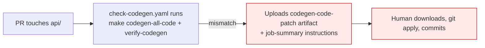

**Proposed:**
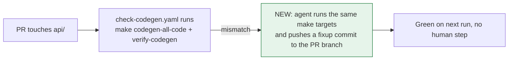

This is one of the safer first agent actions: deterministic, fully reversible — it's just re-running a `make` target the human would've run anyway — and it closes a loop the workflow already does 90% of.

Open questions for you to review: ["1. Open questions for maintainers — Codegen & Verify Gate"](https://github.com/kpj2006/test/blob/main/lfx-research-raw-codegen-gate.md#1-open-questions-for-maintainers-codegen--verify-gate)

---

## 6. Flaky Test Lifecycle & Maintainer Digest

### 6.1 Quarantine already exists as a runtime patch, not a design gap

Two suppression mechanisms coexist: 4 statically committed `skip: true` tests, and a dynamic `quarantined-tests` input that runs `yq eval '.spec.skip = true' -i` on matching `chainsaw-test.yaml` files at CI runtime, wired into `tests-conformance.yaml` for `applyconfiguration` and `sync-modify-downstream`. The git history explains why the dynamic version exists at all: PR #14199 deleted a flaky test outright, #14200 reverted that and landed a hardcoded skip instead, and #14570 — about a month later — introduced the `quarantined-tests` input specifically so nobody would have to hand-edit the workflow file again.
See: [`tests-conformance.yaml`](https://github.com/kyverno/kyverno/blob/main/.github/workflows/tests-conformance.yaml), [#14570](https://github.com/kyverno/kyverno/pull/14570)

### 6.2 There's no flakiness data to act on yet

Chainsaw supports `--report-format`/`--report-path` upstream; Kyverno never passes either flag. So failures are visible only as raw stdout in the Action log, and nothing today can compute a flip rate because no machine-readable per-test result exists anywhere.

**Today:**
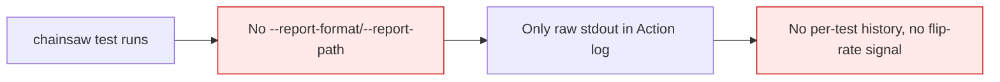

**Proposed:**
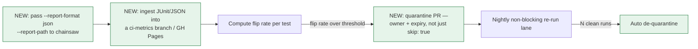

Zero infra cost — a flat file in a branch or GitHub Pages is enough at this scale. The expiry matters as much as the quarantine itself: an owner and a date on the PR, not a skip that silently outlives whoever added it — which is exactly what happened to the 4 static `skip: true` tests already in the repo, none of which carry an explanatory comment or issue reference.

### 6.3 The same data feeds a free weekly maintainer digest

`.github/actions/workflow/failure-issue` already opens an issue on failure and closes it on the next green run, so the open→close interval of `workflow-failure` issues (95 open today) is itself a free flakiness time-series with zero new infrastructure. A weekly digest is just a week-over-week delta on that series, posted as a single pinned issue edited in place rather than re-posted each time.
See: [`failure-issue/action.yaml`](https://github.com/kyverno/kyverno/blob/main/.github/actions/workflow/failure-issue/action.yaml)

Open questions for you to review: ["1. Open questions for maintainers — Flaky Test Lifecycle & Maintainer Digest"](https://github.com/kpj2006/test/blob/main/lfx-research-raw-flaky-tests.md#1-open-questions-for-maintainers-flaky-test-lifecycle--maintainer-digest)

---

## 7. Smaller Automation Gaps

### 7.1 DCO sign-off — the gap is just reactive guidance

DCO is already enforced by the GitHub DCO App, and `.github/config.yml`'s `newPRWelcomeComment` already reminds first-time contributors to sign off; `AGENTS.md` even documents the recovery command. The only real gap is posting that exact command — `git rebase --signoff <base>` — the moment the DCO check actually fails, instead of leaving a contributor to go find it themselves.
See: [`config.yml`](https://github.com/kyverno/kyverno/blob/main/.github/config.yml), [`AGENTS.md`](https://github.com/kyverno/kyverno/blob/main/AGENTS.md)

### 7.2 Auto-backport already exists — the gap is conflict handling

`/cherry-pick <branch>` (`comment-cherry-pick.yaml`) plus `cherry-pick-on-merge.yaml` already backport on request. The one real gap: a failed cherry-pick today just posts "check workflow logs" — no conflict summary, no draft PR left for a human to actually resolve.
See: [`cherry-pick-on-merge.yaml`](https://github.com/kyverno/kyverno/blob/main/.github/workflows/cherry-pick-on-merge.yaml)

### 7.3 Security advisory triage — a caution, not a build

`VULN-TEMPLATE.md` and `SECURITY.md` already exist for reporting. I'd caution against an LLM agent reading private security advisories at all — that's an exfiltration path on a security product. Any advisory-related automation should stay confined to public CVE cross-referencing, which the dependency-review gate in §1.2 already covers — not a new capability that reads private reports.
See: [`SECURITY.md`](https://github.com/kyverno/kyverno/blob/main/SECURITY.md)

Open questions for you to review: ["1. Open questions for maintainers — Smaller Automation Gaps"](https://github.com/kpj2006/test/blob/main/lfx-research-raw-automation-gaps.md#1-open-questions-for-maintainers-smaller-automation-gaps)

---

## 8. Repo Structure & Agent Guardrails

### 8.1 Monorepo restructuring — evaluated, and the answer is no

The root `go.mod` is the only real module; the `github.com/kyverno/*` dependencies (`api`, `sdk`, `pkg/ext`, etc.) come in as ordinary pseudo-versioned Go modules with no `replace` directives pointing at local paths, and there are no git submodules. The only cross-repo coupling found is a single fork-patch `replace` for `k8s.io/pod-security-admission`. Splitting further would fragment an already-correctly-modularised codebase; pulling the satellite repos in would just relocate the coupling, not remove it — worth stating as evaluated-and-rejected rather than spending phase time re-confirming it.

### 8.2 Deepening AGENTS.md: per-directory stubs, a machine-readable task index, and a real safety boundary

Root `AGENTS.md` is already ~246 lines and unusually good — full make-target tables, API versioning rules, a DCO+codegen failure-prevention checklist. The highest-churn directory with the least coverage is `pkg/cel/` (910 touches in 12 months, more than `pkg/engine`+`pkg/webhooks`+`pkg/background` combined, and barely mentioned) — that's where a per-directory `AGENTS.md` should land first, ahead of `pkg/engine`/`pkg/webhooks`/`test/conformance` as the issue assumes.

The task index is close to free: `make help` already documents 123 targets via a `target: ## description` convention, so `make codegen-agent-manifest` just needs to parse that into `.github/agent-manifest.json`, hand-annotated with `needs_cluster` and `approx_minutes`.

For the safety boundary: not a gist — unversioned, unreviewable, outside branch protection, a non-starter on a security project. `.github/ai-maintainer.yaml`, CODEOWNERS-protected, listing `never_touch` (`api/kyverno/v1/**`, `pkg/cosign/**`, `pkg/notary/**`, `charts/kyverno/templates/rbac/**`) versus `agent_autonomous` paths. The differentiator worth leaning on: express that same boundary as an actual Kyverno `ClusterPolicy`, and validate an agent's proposed action against it with `kubectl-kyverno` in CI — Kyverno enforcing its own agent's permissions with Kyverno policy.
See: [`AGENTS.md`](https://github.com/kyverno/kyverno/blob/main/AGENTS.md)

### 8.3 Structured PR metadata — mostly a consumption problem, not a missing-data problem

`semantic.yml` and the `/kind` labels already classify PRs; nothing downstream reads that classification. The one real gap is a deterministic breaking-API check specifically — the rules already written into `AGENTS.md`'s API Design Rules (no new types in `v1`, no attribute deletion/modification without a 3-minor-release deprecation window) are directly checkable against an `api/**` diff without any LLM judgment.

### 8.4 Delegating per-directory work instead of one flat agent

Splitting `AGENTS.md` per directory only pays off if something actually routes to the right stub instead of loading all of them — the same problem AOSSIE's own [Skills Ecosystem](https://github.com/AOSSIE-Org/Skills) and the `org-wide-skills/` structure on my [Template-Repo skills branch](https://github.com/kpj2006/SocialShareButton/tree/matt-skills) are built around: per-repo/per-area skill files, plus something that answers from the right one instead of one growing root file. The same shape fits here — a per-directory `AGENTS.md` a coding agent reads directly, and a thinner root file that just points to them.

Open questions for you to review: ["1. Open questions for maintainers — Repo Structure & Agent Guardrails"](https://github.com/kpj2006/test/blob/main/lfx-research-raw-agent-guardrails.md#1-open-questions-for-maintainers-repo-structure--agent-guardrails)
