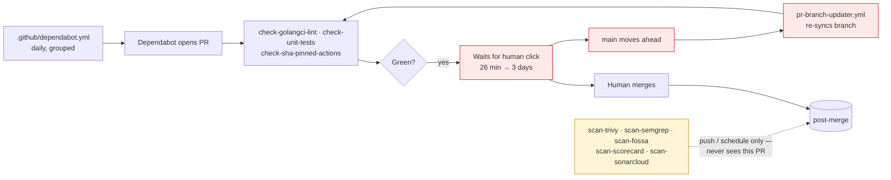
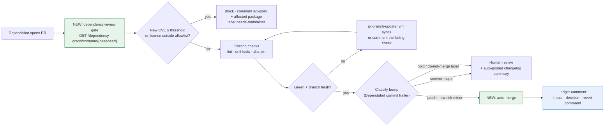

# Kyverno AI Maintainer Assistant — LFX Mentorship Proposal

> **Note:** This proposal is an integration of research already documented across multiple `.md` files in `prop/`.
> Raw evidence, full workflow reads, and live GitHub API results are intentionally kept in those files to avoid duplication here.
> Every number below is re-verifiable — I've linked the exact section header where it came from.
> **Reviewers are encouraged to open the linked sections** rather than trust the summary.

---

## 1. Dependency PR Handling

### 1.1 Problem Statement

The issue description says maintainers spend recurring effort "reviewing/merging Dependabot PRs." Before designing anything I went and measured what that effort actually is, because the shape of the fix depends entirely on whether the problem is *volume* or something else. It turned out to be something else.

**1. Volume is already solved — so auto-merge can't be pitched as a volume fix**

`dependabot.yml` already groups `kubernetes`, `sigstore`, and `otel`, and at the time I checked there was exactly **1** open Dependabot PR (#17141) against **62 merged in the last 90 days** and 1,401 all-time. If I proposed "reduce bot PR noise," I'd be solving a problem the maintainers already fixed.
→ See: ["3. Real GitHub data (via MCP, live)"](https://github.com/kpj2006/test/blob/main/lfx-research-raw-deps.md#3-real-github-data-via-mcp-live-2026-08-16)

> *Screenshot to attach: `is:pr is:open author:app/dependabot` on kyverno/kyverno — one result.*

**2. The real cost is waiting, not reviewing**

I sampled 12 recent merged Dependabot PRs commit-by-commit. In **every single one**, Dependabot's own commit was never amended, never force-pushed, never followed by a human fix-up — CI passed first try each time. The only extra commits were `Merge branch 'main' into dependabot/...`. So maintainers aren't fixing broken bumps. They're just… clicking merge, eventually. Time-to-merge ranged from ~26 minutes to ~3 days.
→ Have a look at [the same section — per-PR table with times and commit counts](https://github.com/kpj2006/test/blob/main/lfx-research-raw-deps.md#3-real-github-data-via-mcp-live-2026-08-16)

**3. Meanwhile nothing checks a dependency bump before it merges**

This is the part I did not expect. I read all seven scan workflows in full. **Every one of them runs on `push` or `schedule` — none on `pull_request`.** Trivy, Semgrep, Scorecard, SonarCloud, FOSSA: all post-merge or nightly. Semgrep is additionally run with `--no-error`, so it structurally cannot fail its own job even if it were on a PR. The only workflow that genuinely gates a PR is `check-sha-pinned-actions.yaml`, and that checks SHA pinning of Actions — not whether a bumped package has a CVE.

There is no `dependency-review-action` anywhere in `.github/`. So today a bump introducing a vulnerable or badly-licensed package merges cleanly, and surfaces afterwards as an auto-filed issue from `sync-trivy-issues.yaml`.
→ See: ["1. Security/scan workflow table"](https://github.com/kpj2006/test/blob/main/lfx-research-raw-deps.md#1-securityscan-workflow-table-full-read-of-every-file) and ["4. PR-time security gaps"](https://github.com/kpj2006/test/blob/main/lfx-research-raw-deps.md#4-pr-time-security-gaps)

**4. Two ecosystems are invisible to Dependabot entirely** (this gap is noted if you're interested lmk )

There are **no Dockerfiles in the repo at all** — images are built with `ko`, and `.ko.yaml` pins its base image `ghcr.io/wolfi-dev/static:alpine` by **floating tag, not digest**. Dependabot's `docker` ecosystem parses Dockerfiles, so even adding it wouldn't see this. Separately, `charts/kyverno/Chart.yaml` pins 3 real external chart dependencies (`kyverno-api`, `openreports`, `reports-server`) that no automation touches.
→ Have a look at ["8. Docker / Helm dependency gaps"](https://github.com/kpj2006/test/blob/main/lfx-research-raw-deps.md#8-docker--helm-dependency-gaps)

**5. A concrete first PR: `DEPENDENCY-POLICY.md` itself has drifted**

I observed that `DEPENDENCY-POLICY.md` names four workflow files that don't exist under those names anymore — it says `trivy.yaml`, `trivy-periodic-scan.yaml`, `lint.yaml`, `scorecard.yaml`, but the real files are `scan-trivy.yaml`, `periodic-trivy.yaml`, `check-golangci-lint.yaml`, `scan-scorecard.yaml`. Nothing in CI catches this, so the policy doc has been silently wrong for a while. So a small PR should be made: update `DEPENDENCY-POLICY.md` to reference the actual filenames — a two-line diff, verifiable in minutes, and something I can land before the mentorship starts to show I've actually read the repo.
→ See: ["8.2 CODEOWNERS has already drifted"](https://github.com/kpj2006/test/blob/main/kyverno-lfx-research.md#82-codeowners-has-already-drifted--with-a-reproducible-example)

---

### 1.2 How it works today

Red = the loop that costs runner-minutes and maintainer attention while adding no safety. Yellow = every scanner in the repo, sitting outside the PR path.

### 1.3 What I propose

Two features, deliberately independent so they can land and be judged separately:

**Feature 1 — the gate.** I've built this exact gate before, for AOSSIE's Template-Repo: [`dependency-review-action.yml`](https://github.com/AOSSIE-Org/Template-Repo/blob/main/.github/workflows/dependency-review-action.yml). Action reference: [actions/dependency-review-action](https://github.com/actions/dependency-review-action). The work here is adapting the severity/license rules to Kyverno's `DEPENDENCY-POLICY.md`.

**Feature 2 — the exit from the queue.** Auto-merge only what the gate cleared and only what's genuinely low-judgment:

| Condition | Rule |
|---|---|
| Author | `dependabot[bot]` only — never a human-authored bump |
| Bump level | `semver-major` → **always** human |
| Risk tier | low: `gomod`/`actions` patch, `actions` minor · medium: `gomod` minor · else → human |
| Labels | any `hold` / `do-not-merge` / `wip` → stop |
| Checks | all required green **on the latest commit**, not a stale run |
| Freshness | branch not behind `main` (`pr-branch-updater.yml` resolves first) |

Full predicate pseudocode: ["7. Auto-merge predicate"](https://github.com/kpj2006/test/blob/main/lfx-research-raw-deps.md#7-auto-merge-predicate-proposed-pseudocode)

Open questions for you to review: ["9. Open questions for maintainers — Dependency PR Handling"](https://github.com/kpj2006/test/blob/main/lfx-research-raw-deps.md#9-open-questions-for-maintainers-dependency-pr-handling)
